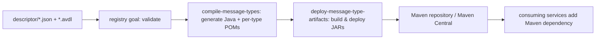

# Building and publishing

The registry is a single Maven module (`packaging=pom`); the `pom.xml` does not build application code
— it drives the validation of the registry and the publishing of one Java artifact per message-type
version. The plugins that do the work come from the
[jeap-messaging](https://github.com/jeap-admin-ch/jeap-messaging) library.

## Build flow



Run the validation locally with:

```bash
./mvnw verify
```

## Plugins

- **`jeap-messaging-registry-maven-plugin`** (`registry` goal) — validates that the registry is
  internally consistent and that released schema versions are not modified.
- **`jeap-messaging-avro-maven-plugin`**:
  - `compile-message-types` — reads the descriptors and Avro schemas and generates the Java binding
    and a Maven project for each message type, using `messagetype.template.pom.xml` as the POM
    template. Configured with `groupIdPrefix = ch.admin.bit.jeap.messagetype`, `trunkBranchName =
    master`, and `generateAllMessageTypes = false` (only generate what changed relative to the trunk).
  - `deploy-message-type-artifacts` — builds and deploys the generated artifacts. The
    `maven-central-publish` profile (from the template POM) signs and publishes them to Maven Central.

The `jeap.messagetypes.compile.skip` property skips message-type code generation; the publish step in
the pipeline sets it to `true` to avoid regenerating sources when only deploying.

## Generated artifact coordinates

For a type named `<TypeName>` defined by system `<SYSTEM>`:

- **Group id**: `ch.admin.bit.jeap.messagetype.<system-lowercase>`
- **Artifact id**: `<type-name>` in kebab-case (e.g. `ProcessSnapshotCreatedEvent` →
  `process-snapshot-created-event`)
- **Version**: each descriptor `version` is published separately

Each generated artifact depends on `jeap-messaging-infrastructure-kafka` (scope `provided`) and bundles
the Avro-generated event/command class and its builder. See the actual coordinates in the
[Message-type catalog](message-types.md).

## Related

- [Registry structure](registry-structure.md)
- [Message-type catalog](message-types.md)
- [Getting started](getting-started.md)
- [jeap-message-type-registry](../README.md)
